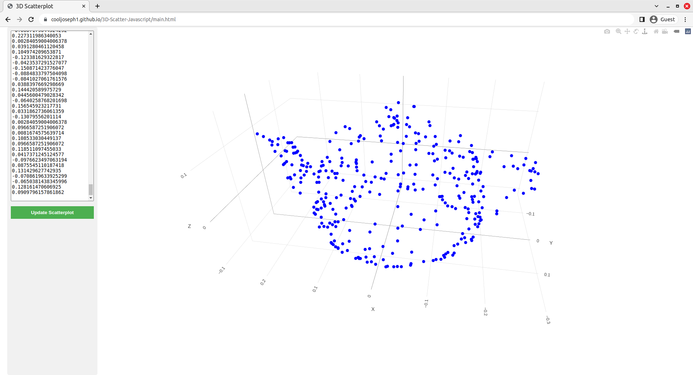

# 3D Scatter Javascript
One day, I was sufficiently annoyed at not finding a tool online to make a scatterplot from a list of 3D points, so I made this in Javascript with Plotly.

## Usage
Put a list of 3D points in the textbox on the left. They will get plotted on the right. I tried to make it parse different kinds of inputs. It will definitely work with any of the following formats:
```
[[1, 2, 3], [4, 5, 6]]
```
or
```
1, 2, 3
4, 5, 6
```
or
```
1 2 3
4 5 6
```


## Screenshot
